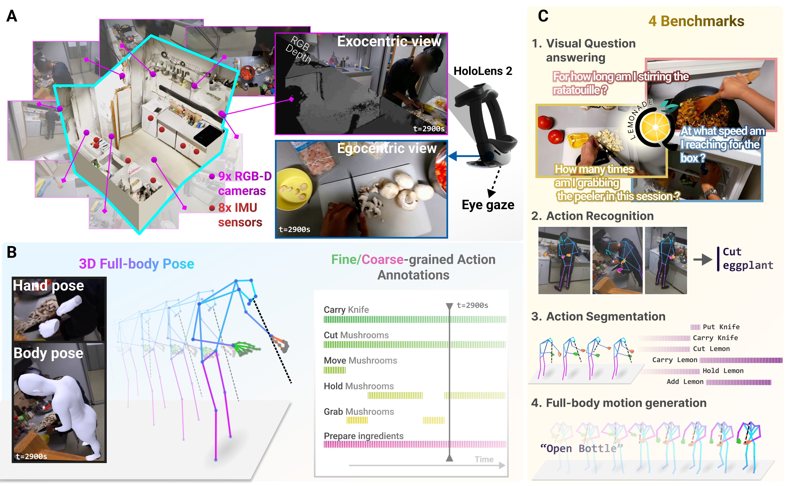

# EPFL-Smart-Kitchen


[](https://arxiv.org/abs/2506.01608)

[](https://zenodo.org/records/15535461)
[](https://zenodo.org/records/15551913)
[](https://huggingface.co/datasets/amathislab/LEMONADE)


- [Abstract](#abstract)
- [Download our dataset](#find-our-dataset)
- [Run our benchmarks](#run-our-benchmarks)
- [Publications](#publications)

## 📚 Abstract

Understanding behavior requires datasets that capture humans while carrying out complex tasks. The kitchen is an excellent environment for assessing human motor and cognitive function, as many complex actions are naturally exhibited in kitchens from chopping to cleaning. Here, we introduce the **EPFL-Smart-Kitchen-30** dataset, collected in a noninvasive motion capture platform inside a kitchen environment. Nine static RGB-D cameras, inertial measurement units (IMUs) and one head-mounted HoloLens~2 headset were used to capture 3D hand, body, and eye movements. The EPFL-Smart-Kitchen-30 dataset is a multi-view action dataset with synchronized exocentric, egocentric, depth, IMUs, eye gaze, body and hand kinematics spanning 29.7 hours of 16 subjects cooking four different recipes. Action sequences were densely annotated with 33.78 action segments per minute. Leveraging this multi-modal dataset, we propose four benchmarks to advance behavior understanding and modeling through 
1) a vision-language benchmark, 
2) a semantic text-to-motion generation benchmark, 
3) a multi-modal action recognition benchmark, 
4) a pose-based action segmentation benchmark. We expect the EPFL-Smart-Kitchen-30 dataset to pave the way for better methods as well as insights to understand the nature of ecologically-valid human behavior.



## 💾 Find our datasets
You can download the dataset on the following links:
| Link | Description |
|------|-------------|
| Collected data            | [Download (Zenodo)](https://zenodo.org/records/15535461) |
| Pose and Annotations data | [Download (Zenodo)](https://zenodo.org/records/15551913) |
| All benchmarks on Hugging Face | [Download (HuggingFace)](https://huggingface.co/collections/amathislab/esk-benchmarks) |

The collected data contains all recorded RGB and depth videos, IMU sensors, hand pose and eye gaze recorded from the HoloLens2, and meta information. Pose and Annotations data are the processed 3D body and hand pose along with the manual annotations of actions and activities. Egocentric videos are also available on HuggingFace, prepared for model evaluation of the Lemonade benchmark.

## 📈 Run our Benchmarks
Based on our dataset, we present four exciting benchmarks. Follow the links for more details on data preparation, checkpoints, and usage:
* [Action recognition](benchmarks/action_recognition/)
* [Action segmentation](benchmarks/action_segmentation)
* [Full-body motion generation](benchmarks/motion_generation)
* [Lemonade : Question Answering](benchmarks/lemonade/)


## 🌟 Citations
```
@misc{bonnetto2025epflsmartkitchen30,
    title={EPFL-Smart-Kitchen-30: Densely annotated cooking dataset with 3D kinematics to challenge video and language models}, 
    author={Andy Bonnetto and Haozhe Qi and Franklin Leong and Matea Tashkovska and Mahdi Rad and Solaiman Shokur and Friedhelm Hummel and Silvestro Micera and Marc Pollefeys and Alexander Mathis},
    year={2025},
    eprint={2506.01608},
    archivePrefix={arXiv},
    primaryClass={cs.CV},
    url={https://arxiv.org/abs/2506.01608}, 
}
```
    
## ❤️ Acknowledgements 
We thank members of the Mathis Group for Computational Neuroscience & AI (EPFL) for their feedback throughout the project. Special thanks to Joséphine Raugel and Federica Smeriglio for the support in the set up of the motion capture platform and the data collection. This work was funded by EPFL, Swiss SNF grant (320030-227871), Microsoft Swiss Joint Research Center and a Boehringer Ingelheim Fonds PhD stipend (H.Q.). We are grateful to the Brain Mind Institute for providing funds for hardware and to the Neuro-X Institute for providing funds for services.