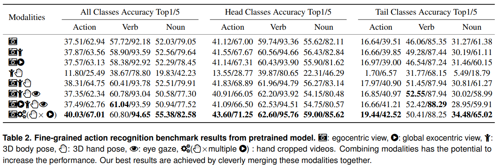

# 🎬 EPFL-Smart-Kitchen: Action Recognition Benchmark

Welcome to the action recognition benchmark for the EPFL-Smart-Kitchen dataset! This benchmark provides a comprehensive framework for evaluating action recognition models on naturalistic cooking activities captured in the EPFL-Smart-Kitchen.

## 📋 Overview

This codebase enables you to reproduce the results from the action recognition benchmark presented in our paper. We leverage state-of-the-art video understanding models, specifically VideoMAE, and 3D pose estimation, fine-tuned on our dense action annotations. 

### ✨ Key Features

- 🎯 **Multi-modal cooking action recognition** with hierarchical labels
- 📊 **Benchmark evaluation scripts** for standardized comparison
- 🔄 **Pre-trained model fine-tuning** pipeline
- 📈 **Comprehensive metrics** and evaluation tools

## 🚀 Quick Start

### 📦 Dataset Preparation

Download the EPFL-Smart-Kitchen action recognition dataset from Hugging Face:

```bash
bash benchmarks/action_recognition/download_from_hf.sh
```

How to unzip (Linux):

1) Ensure all parts are in the same directory (as above).
2) Use either unzip or 7-Zip, starting from the `.zip` file (not the `.z01`).

- With unzip (preinstalled on many systems):
```bash
unzip benchmark_data.zip
unzip checkpoints.zip
```

- With 7-Zip (if you prefer):
```bash
# install if needed (Debian/Ubuntu)
sudo apt-get update && sudo apt-get install -y p7zip-full

7z x benchmark_data.zip
7z x checkpoints.zip
```

Notes:
- Don’t try to extract the `.z01` files directly—always open the corresponding `.zip` file.
- If extraction fails, verify that all parts are fully downloaded and present.

After extracting the files, you will get the following folders:
```
ESK_action_recognition
├── Benchmark_data
|   ├── [PARTICIPANT_ID]/[SESSION_ID]
├── Annotations
|   ├── [SPLIT].csv
├── Hand_videos
|   ├── [SPLIT]
├── pose_data
|   ├── [PARTICIPANT_ID]/[SESSION_ID]
├── checkpoints
|   ├── [INPUT_TYPE]_experiment
|   ├── [INPUT_TYPE]_nopretrain_experiment
└── README.md
```

### 🛠️ Model Training

You can find the complete code to fine-tune VideoMAE on our dataset here:
👉 [Multi-modal-MAE Repository](https://github.com/amathislab/Multi-modal-MAE)

The repository includes:
- Training scripts with optimized hyperparameters
- Pre-processing pipelines for video data
- Evaluation and inference code

  To quickly start training/evaluation, you can refer to the [holo_crop.sh](https://github.com/amathislab/Multi-modal-MAE/blob/main/bash_files/holo_crop.sh) file and replace the paths (e.g., anno_path, data_path, etc.).

## 🏆 Results



## 🙏 Acknowledgements

We thank the authors of [VideoMAE](https://github.com/MCG-NJU/VideoMAE) for open-sourcing their codebase, which forms the foundation of our action recognition pipeline.

### 📚 Citation

If you use VideoMAE in your research, please cite:

```bibtex
@inproceedings{tong2022videomae,
  title={Video{MAE}: Masked Autoencoders are Data-Efficient Learners for Self-Supervised Video Pre-Training},
  author={Zhan Tong and Yibing Song and Jue Wang and Limin Wang},
  booktitle={Advances in Neural Information Processing Systems},
  year={2022}
}
```
