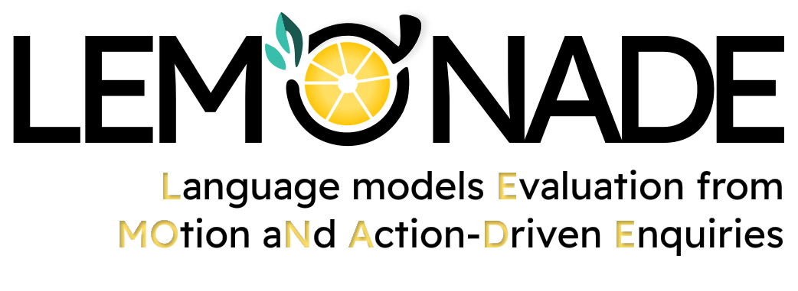
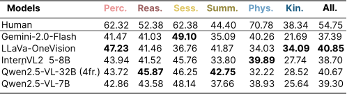

# 🍋 EPFL-Smart-Kitchen: Lemonade benchmark



## 📚 Introduction
 we introduce Lemonade: **L**anguage models **E**valuation of **MO**tion a**N**d **A**ction-**D**riven **E**nquiries.
Lemonade consists of <span style="color: orange;">36,521</span> closed-ended QA pairs linked to egocentric video clips, categorized in three groups and six subcategories. <span style="color: orange;">18,857</span> QAs focus on behavior understanding, leveraging the rich ground truth behavior annotations of the EPFL-Smart Kitchen to interrogate models about perceived actions <span style="color: tomato;">(Perception)</span> and reason over unseen behaviors <span style="color: tomato;">(Reasoning)</span>. <span style="color: orange;">8,210</span> QAs involve longer video clips, challenging models in summarization <span style="color: gold;">(Summarization)</span> and session-level inference <span style="color: gold;">(Session properties)</span>. The remaining <span style="color: orange;">9,463</span> QAs leverage the 3D pose estimation data to infer hand shapes, joint angles <span style="color: skyblue;">(Physical attributes)</span>, or trajectory velocities <span style="color: skyblue;">(Kinematics)</span> from visual information.

## 💾 Content
Lemonade contains all egocentric videos recorded in the EPFL-Smart-Kitchen-30 dataset and the question answer pairs of the benchmark. The dataset is available on HuggingFace at [https://huggingface.co/datasets/amathislab/LEMONADE](https://huggingface.co/datasets/amathislab/LEMONADE).

### 🗃️ Repository structure

```
Lemonade
├── MCQs
|   └── lemonade_benchmark.csv
├── videos
|   ├── YH2002_2023_12_04_10_15_23_hololens.mp4
|   └── ..
└── README.md
```

`lemonade_benchmark.csv` : Table with the following fields:

**Question**  : Question to be answered. </br>
**QID** : Question identifier, an integer from 0 to 30. </br>
**Answers** : A list of possible answers to the question. This can be a multiple-choice set or open-ended responses. </br>
**Correct Answer** : The answer that is deemed correct from the list of provided answers. </br>
**Clip** : A reference to the video clip related to the question. </br>
**Start** : The timestamp (in frames) in the clip where the question context begins. </br>
**End** : The timestamp (in frames) in the clip where the question context ends. </br>
**Category** : The broad topic under which the question falls (Behavior understanding, Long-term understanding or Motion and Biomechanics). </br>
**Subcategory** : A more refined classification within the category (Perception, Reasoning, Summarization, Session properties, Physical attributes, Kinematics). </br>
**Difficulty** : The complexity level of the question (e.g., Easy, Medium, Hard).

`videos` : Folder with all egocentric videos from the EPFL-Smart-Kitchen-30 benchmark. Video names are structured as `[Participant_ID]_[Session_name]_hololens.mp4`.

> We refer the reader to the associated publication for details about data processing and tasks description.

## 📈 Evaluation results


## 🌈 Usage
The evaluation of the benchmark can be done using Lmms-eval [[1]] : [https://github.com/EvolvingLMMs-Lab/lmms-eval](https://github.com/EvolvingLMMs-Lab/lmms-eval)


## 🌟 Citations
Please cite our work!
```
@misc{bonnetto2025epflsmartkitchen,
      title={EPFL-Smart-Kitchen-30: Densely annotated cooking dataset with 3D kinematics to challenge video and language models}, 
      author={Andy Bonnetto and Haozhe Qi and Franklin Leong and Matea Tashkovska and Mahdi Rad and Solaiman Shokur and Friedhelm Hummel and Silvestro Micera and Marc Pollefeys and Alexander Mathis},
      year={2025},
      eprint={2506.01608},
      archivePrefix={arXiv},
      primaryClass={cs.CV},
      url={https://arxiv.org/abs/2506.01608}, 
}
```

## ❤️ Acknowledgments

Our work was funded by EPFL, Swiss SNF grant (320030-227871), Microsoft Swiss Joint Research Center and a Boehringer Ingelheim Fonds PhD stipend (H.Q.). We are grateful to the Brain Mind Institute for providing funds for hardware and to the Neuro-X Institute for providing funds for services.